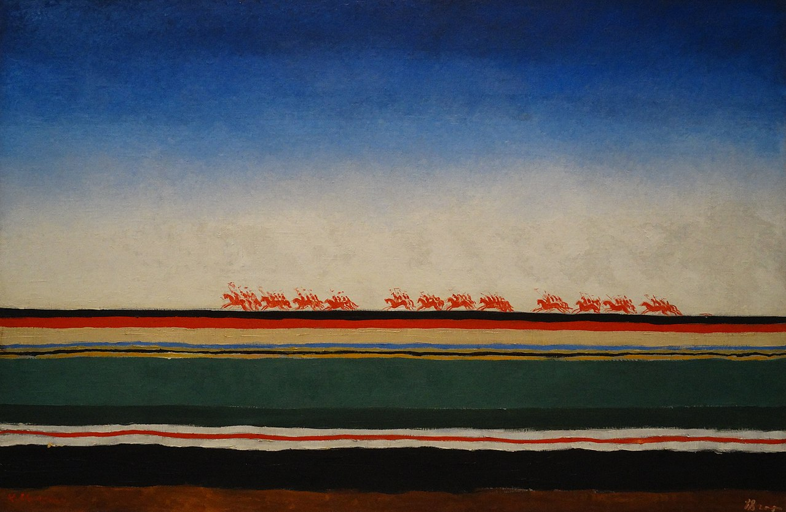

### Hi, I'm Mikhail!

Я Junior Frontend разработчик, обучающийся на Hexlet.io.  
Связаться со мной:   
Резюме:  

---

### Languages and Tools

 

---

##### Открыт к новым челленджам и интересным задачам!
